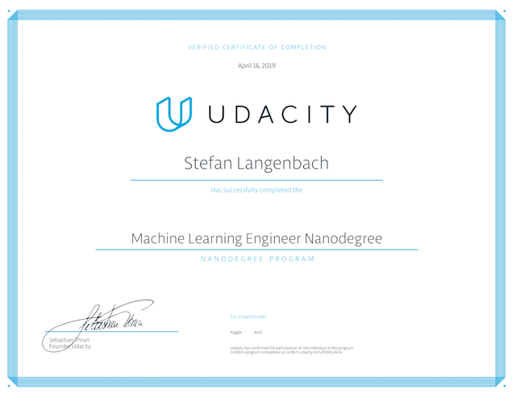

# Machine Learning Engineer Nanodegree
This repo contains all information regarding Udacity's [machine learning engineer nanodegree](https://eu.udacity.com/course/machine-learning-engineer-nanodegree--nd009).  
It is structured around the following projects:

1. Predicting Boston housing prices using scikit-learn
2. Finding donors via machine-learning using scikit-learn
3. Identifying dog breeds via neural networks using keras
4. Finding customer segments using scikit-learn
5. Teaching quadcoptors to fly using deep deterministic policy agents
6. Capstone project: [Santander customer transaction prediction challenge](https://www.kaggle.com/c/santander-customer-transaction-prediction) using pandas, scikit-learn, featuretools, lightGBM and XGBoost

