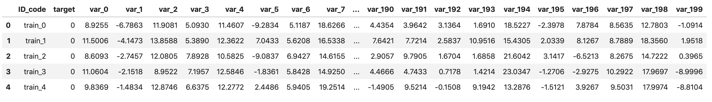
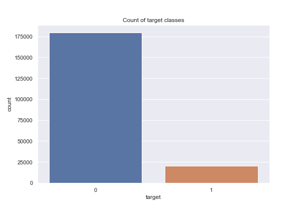
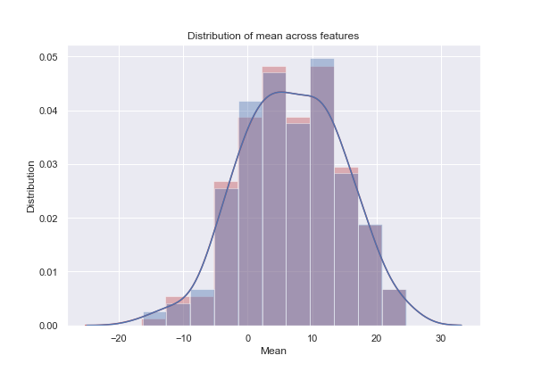
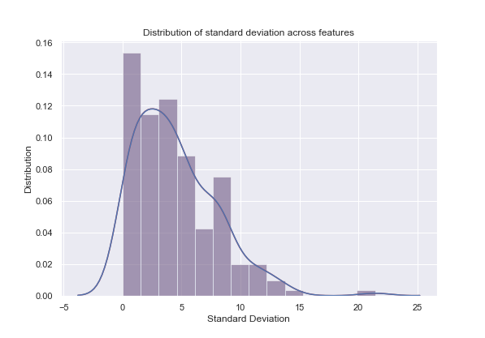
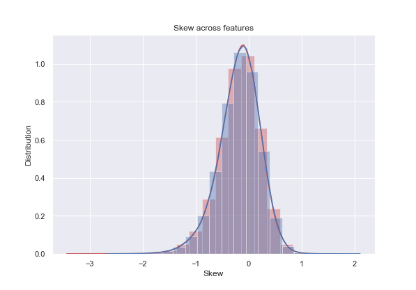
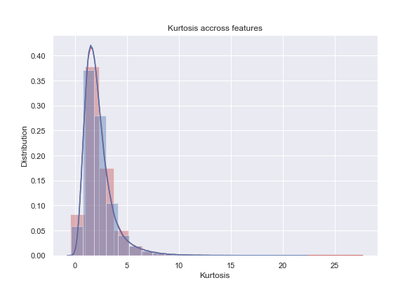
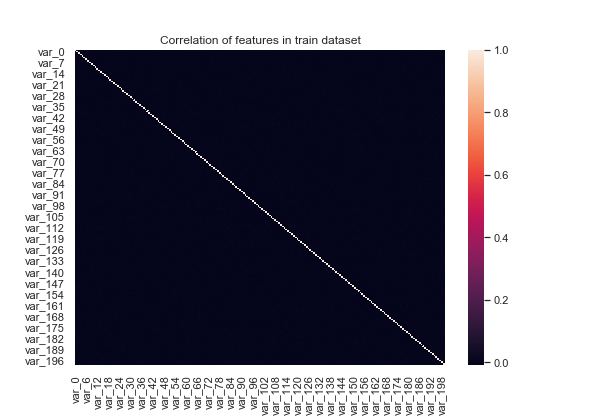
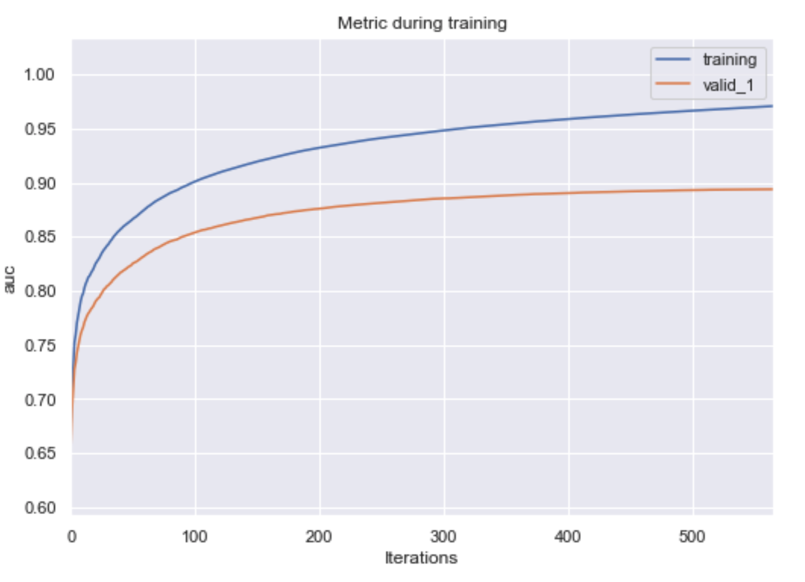
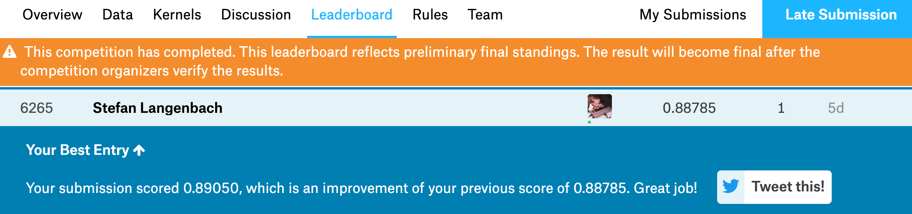
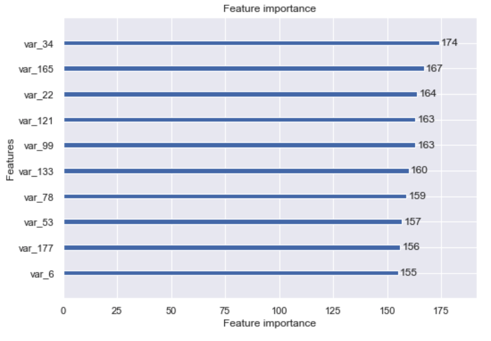

# Machine Learning Engineer Nanodegree
## Capstone Project
Stefan Langenbach  
April 2019

## I. Definition

### Project Overview
The challenge to forecast customer behaviour is prevalent in many industries. This project investigates a specific 
variant of this problem in the financial services industry, specifically in consumer banking: To forecast which
customers will make a specific transaction in the future, irrespective of its amount. While machine learning techniques
have been used in the financial industry extensively, i.e. to score consumer credit risk [[1](#References)]
or to detect fraudulent transactions [[2](#References)], there does not seem to be a lot of research regarding 
transaction forecasting.

### Problem Statement
The need for specific financial services and products is closely tied to customers' living situations, i.e. if they are
planning to attend college, start a family or buy real estate. In order to gain insight into their customers financial
situation, banks can use the history of their transactions. For the case at hand, the challenge is to **identify, which
customers will make a specific transaction in the future**, not taking into account the amount of that transaction. This
is a classical binary (0/1, yes/no) classification problem often found in the realm of data science.

### Metrics
The evaluation metric used for this project is the 
[area under the ROC curve](https://en.wikipedia.org/wiki/Receiver_operating_characteristic) between the predicted 
probability of a customer making a specific transaction (calculated by a machine learning model) and the observed 
target, i.e. the actual transaction made by a customer in the past (available in the test dataset).

## II. Analysis

### Data Exploration
The data for this project is provided by [Santander Bank](https://www.santanderbank.com/us/personal) 
through a [Kaggle Competition](https://www.kaggle.com/c/santander-customer-transaction-prediction). It is anonymized 
but its structure is identical to the data the bank uses to solve similar problems internally. The data is split into
training and testing set, each consisting of 200,000 observations and 202 (201 for the test set as dependent variable
`target` is omitted) variables. As one of those 202/201 variables (`ID_code`) is just an index, there are really 
just 201/200 variables available for analysis. Moreover, as the the classes for dependent variable `target` are highly 
imbalanced (only roughly 10% are labeled 1, 90% are labeled 0), we made appropriate adjustments (c.f. 
[algorithm and techniques](#Algorithms-and-Techniques)) during the modeling process. Further, as no dedicated 
validation set is supplied by Kaggle, we constructed it manually (c.f. [data preprocessing](#Data-Preprocessing))
by splitting the provided training set into training and validation sets - again taking into account class imbalance. 
It is noteworthy that the data does **not** contain any missing values. Further, all dependent variables are of type
float and do not need to be converted for further analysis.

A sample of the data is provided below:

### Exploratory Visualization
In order to investigate certain characteristics of the data, i.e. distribution of classes, mean, standard deviation, 
etc., the following visualizations where created.

Although the problem of class imbalance related to the target variable has been discussed above, the plot below 
emphasizes the issues visually. Only a very small fraction of samples in the training data belong to class 1, i.e.
customers that made a specific transaction in the past.

The next plot is concerned with the distribution of means across all features, i.e. all dependent variables except 
`ID_code`. Although there are some slight differences between train- and test set, data is roughly normally distributed.

A logical follow up to the investigation of the distribution of means is the investigation of standard distributions. In 
contrast to the distribution of means, there do not seem to be differences between train- and test set, however it is 
noteworthy that the distribution of standard deviations has a tail to its right side (positive skew), meaning that some 
features have particularly large standard deviations. 

Following up on the slight positive skew of the distribution of standard deviations, we investigate the skew of all 
features. As is evident from the plot, most features are **not** severely skewed but follow a normal or half-normal 
distribution

The same is true regarding the kurtosis (a measure of tailedness of a distribution) of all features. 
Most features' kurtosis value represents that of a standard normal distribution (the equivalent kurtosis value is 3)

Finally, we checked if any features exhibited a strong negative/positive correlation among each other. As can be seen
from the heatmaps below, this was not the case, neither for the training, nor for the testing set

Apart from the class imbalance in the target variable, the exploratory analysis of the dataset did not find any 
abnormal characteristics.

### Algorithms and Techniques
For the problem at hand two implementations of the supervised learning technique 
[extreme gradient boosting](https://xgboost.readthedocs.io/en/latest/tutorials/model.html) were chosen: 
[XGBoost](https://xgboost.readthedocs.io/en/latest/index.html) and [LightGBM](https://github.com/Microsoft/LightGBM).
Gradient boosting is an efficient, effective and popular technique for modeling tabular data of varying size with 
decision trees and thus a great fit for this project. Despite being planned in the project proposal, 
deep-learning models were not implemented, as training them was infeasible without a GPU. In order to engineer 
additional features we used a technique called **deep feature synthesis** (DFS) implemented via 
[featuretools](https://docs.featuretools.com/automated_feature_engineering/afe.html#deep-feature-synthesis). DFS is 
a technique to derive large amounts of engineered features from existing features, by applying various transformation
and/or aggregation primitives, i.e. dividing each feature by every other feature within the dataset.

### Benchmark
Given the [evaluation metric specified by the Kaggle Competition](https://www.kaggle.com/c/santander-customer-transaction-prediction#evaluation) 
(area under the ROC curve), the benchmark for the solution was to be better than random choice, 
i.e. reaching a ROC score > 0.5. Our personal ambition was to come up with a solution placing us in the 
top 50% of the [Kaggle leaderboard](https://www.kaggle.com/c/santander-customer-transaction-prediction/leaderboard),
which translated into a ROC score of >= 0.89 (as of the time of writing this proposal).

## III. Methodology

### Data Preprocessing
As no abnormal characteristics or missing values were found during data exploration, data preprocessing was mostly
concerned with dealing with class imbalance of the target variable. Instead of over/undersampling classes while
constructing train and validation sets, we used functionality built into XGBoost and LightGBM, namely the
`is_unbalance` parameter. According to the 
[LightGBM documentation](https://lightgbm.readthedocs.io/en/latest/Parameters.html?highlight=is_unbalance#is_unbalance),
the parameter can and should be used in binary classification problems and helps with unbalanced training data.
Furthermore we did some feature engineering, both manually and using deep feature synthesis. The manual approach 
consisted of calculating mean, median, standard deviation, maximum, minimum, sum, skew and kurtosis of all features for
every observation. Using DFS we applied two transformation primitives, multiply and divide, which created a plethora
of engineered features by multiplying (dividing) each feature by every other feature in the dataset.

### Implementation
The implementation of algorithms and feature engineering techniques was straight forward. We began by splitting
the original train dataset into a train- and validation dataset, where 80% of the data was used for training and 20% for
validation. Splitting was done in a stratified fashion, meaning that the distribution of the classes in the target
variable was preserved over all splits. Next, the data was used to train a baseline model (LightGBM with 
[default parameters](https://lightgbm.readthedocs.io/en/latest/Parameters.html)) for 1000 iterations.
After training and validating the baseline model we proceeded to more advanced setups.

### Refinement
In order to improve upon the results of the baseline model, the following strategies were employed:
* Tune specific hyper parameters of baseline model
* Train baseline model on engineered features
* Train baseline model with learning rate decay (diminishing learning rates over training iterations)
* Train XGBoost model with original features
* Train XGBoost model with engineered features

When tuning hyper parameters, the following parameters were evaluated:
* learning rate: Discount factor used for optimization
* feature_fraction: Percentage of features used for each iteration
* bagging_fraction: Percentage of samples used in each iteration
* bagging_frequency: Size of interval between iterations at which new data is sampled

## IV. Results

### Model Evaluation and Validation
After following through with several refinement strategies, it became evident that the best result was obtained from a
slight variation of the baseline model trained on the original features. By using the following parameters, we reached
a **validation score** of **0.893** and a test score of **0.890**:
* learning_rate: 0.05
* feature_fraction: 0.9
* bagging_fraction: 0.8
* bagging_freq: 5
* is_unbalance: True

The only strategies that came reasonably close to the solution above were LightGBM with learning rate decay, and the 
XGBoost model trained on original features with identical parameters. Their final validation scores (0.873 LightGBM 
with learning rate decay; 0.879 XGBoost) were however slightly worse than that of the top solution.

### Justification
The benchmark for this project was to create a model that performs better than random choice and obtains a ROC score >
0.5. As is evident from the plot above and the 
[Kaggle leaderboard](https://www.kaggle.com/c/santander-customer-transaction-prediction/leaderboard#score) (see below), 
the benchmark has been reached. We were however not placed in the top 50% of the leaderboard, despite the final test 
score of our best submission was 0.890.

## V. Conclusion

### Free-Form Visualization
As discussed in [data exploration](#Data-Exploration) and [data preprocessing](#Data-Preprocessing) sections, the data
did not contain any abnormal characteristics. Without low-hanging fruit in terms of data cleansing objectives, our 
initial guess was that feature engineering could be used to construct sophisticated features with considerable impact 
on modeling and prediction. During the course of analysis we constructed several - albeit simple - engineered features, 
and learned that these did not improve our models at all. On the contrary, the performance of models using engineered 
features was significantly worse than those using the original features. The plot below shows the importance of the 10 
most important features of our best model. Apparently, no single (manually) created feature had a significant impact.

### Reflection
The goal of this project was to find a solution for a binary classification problem in the financial services industry, 
namely to **identify customers who will make a specific transaction in the future**, without taking into account the 
amount of the transaction. In order to so, we used data provided by Santander Bank through a Kaggle competition. After 
investigating the main characteristics of the data, we used two implementations of a supervised machine learning 
technique called "extreme gradient boosting" to arrive at a solution for the problem. We created models of 
varying complexity, with and without additional features, but our best performing solution was a slight variation of 
the initial baseline model. This solution reached an ROC score of 0.890 and was significantly better than the benchmark.
To us this is an interesting observation, because it emphasizes the fact that simple solutions (at least in terms of 
implementation and usage) often outperformed particularly complex ones.

### Improvement
Despite the satisfactory performance of our solution, several strategies can be followed to improve it:
* Further investigate feature engineering by creating (potentially deep) variants of the top performing features
* Augment the original data using oversampling
* Expand hyper parameter tuning by either selecting more parameters to tune and/or greater ranges of parameter values
* Evaluate the performance of simpler, i.e. Naive Bayes, and more complex algorithms, i.e. deep-learning

### References
1. [Consumer credit-risk models via machine-learning algorithms](
https://www.sciencedirect.com/science/article/pii/S0378426610002372), Kandhani et al., 2010
2. [Effective detection of sophisticated online banking fraud on extremely imbalanced data](
https://link.springer.com/article/10.1007/s11280-012-0178-0), Wei Wei et al., 2013